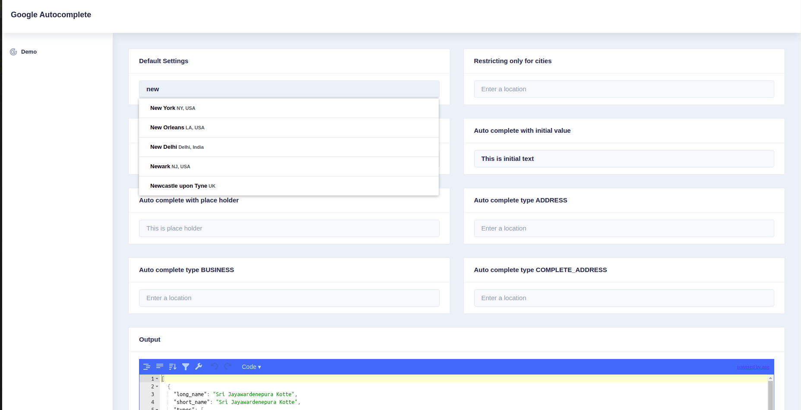

# @scorpiosl4/ngx-google-auto-complete

Angular google auto complete (wrapper for [ngx-google-places-autocomplete](https://github.com/skynet2/ngx-google-places-autocomplete)).

Working with latest Angular 11. 



## Installation

To install this library with npm, run below command:

$ npm install --save ngx-google-places-autocomplete @scorpiosl4/ngx-google-auto-complete


Example:

```html
<ngx-google-auto-complete [options]="options" (onPlaceSelect)="onDataChange($event)"></ngx-google-auto-complete>
```

## Usage

### Configuration

First add your google maps autocomplete api key into following script tag and add it inside index.html header tag

```html
<script defer
    src="https://maps.googleapis.com/maps/api/js?key=ADD_YOUR_API_KEY_HERE_&libraries=places"></script>

```

Next, Import GoogleAutoCompleteModule in root

```ts
import { GoogleAutoCompleteModule } from '@scorpiosl4/ngx-google-auto-complete' 

@NgModule({
  declarations: [
    AppComponent
  ],
  imports: [
    ....,
    GoogleAutoCompleteModule
  ],
  providers: [],
  bootstrap: [AppComponent]
})
export class AppModule { }
```
Then setup your component models as below :

```ts
import { Component, ViewChild } from '@angular/core';
import { Address } from '@scorpiosl4/ngx-google-auto-complete';
import { AUTO_COMPLETE_TYPE, IGoogleAddressComponents, Options } from '@scorpiosl4/ngx-google-auto-complete';

@Component({
  selector: 'app-demo',
  templateUrl: './demo.component.html',
  styleUrls: ['./demo.component.scss']
})
export class DemoComponent {

  public options: Options = {
    types: ['(cities)'],
  };

  public options2: Options = {
    componentRestrictions: { country: 'lk' }, //limit response for a specific country
  }

  public initialTextBoxValue: string = 'This is initial text';
  public placeHolder: string = 'This is place holder';
  public autoCompleteType1: AUTO_COMPLETE_TYPE = 'ADDRESS';
  public autoCompleteType2: AUTO_COMPLETE_TYPE = 'BUSINESS';
  public autoCompleteType3: AUTO_COMPLETE_TYPE = 'COMPLETE_ADDRESS';

  constructor() {
  }

  public onDataChange(data: Address | IGoogleAddressComponents[]) {
    this.data = data;
  }
}

```

Then use the component

```html
<ngx-google-auto-complete [options]="options" (onPlaceSelect)="onDataChange($event)"></ngx-google-auto-complete>
```


# Input configurations

| Input  | Input value type | Usage |
| ------------- | ------------- | ----------- |
| autoCompleteType  | AUTO_COMPLETE_TYPE  | Get complete address or Only country and city |
| textboxValue  | string  | Set initial value of the text box |
| placeHolder  | string  | Set place holder text |
| options  | Options  | Change google results (eg cities only,limit for a specific country, etc..)|


# License
MIT(./LICENSE)